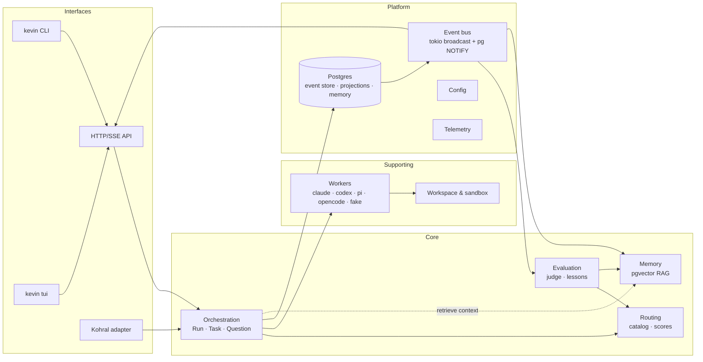
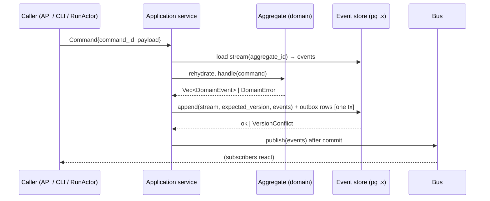

# 01 — Architecture

Kevin is a **modular monolith**: one Rust binary (`kevin`), one Postgres
database, a cargo workspace where each bounded context is a crate. Contexts
communicate through commands (in-process function calls on application
services) and events (persisted, then fanned out on an in-process bus and a
cross-process Postgres `LISTEN/NOTIFY` channel). No crate reads another crate's
tables.



## Bounded contexts

| Context | Crate | Type | Owns | Publishes | Consumes |
|---|---|---|---|---|---|
| Orchestration | `kevin-orchestrator` | core | `Run`, `Task`, `Question` aggregates; run process manager; task graph; budgets | `Run*`, `Task*`, `Question*` events | `RouteSelected` (query), worker streams, evaluation results |
| Workers | `kevin-worker` | supporting | `Worker` trait, CLI adapters, subprocess supervision, output normalisation, usage extraction | `WorkerEvent` stream (not persisted as domain events; orchestrator folds them into `Task*` events + task logs) | task specs |
| Routing | `kevin-router` | core | model catalog, task-kind taxonomy, route scores, selection policy | `RouteScoreUpdated` | `EvaluationRecorded`, `TaskSucceeded/Failed` (cost, latency) |
| Memory | `kevin-memory` | core | memory items, embeddings, retrieval, lessons | `MemoryItemStored`, `LessonLearned` | `RunCompleted`, `EvaluationRecorded`, explicit `Remember` commands |
| Evaluation | `kevin-evaluator` | core | rubrics, judge prompts, evaluation records, proposals | `EvaluationRecorded`, `ProposalRaised` | `TaskSucceeded`, `RunIntegrated` |
| Workspace & sandbox | `kevin-workspace` | supporting | git worktree / jj workspace lifecycle, env allow-list, sandbox tier policy | — | — |
| Interfaces | `kevin-api`, `kevin-tui`, `kevin-cli` | interface | HTTP/SSE API, TUI, CLI commands | — | projections, events |
| Kohral adapter | `kevin-kohral` | anti-corruption layer | Kohral runtime contract (`/v1/capabilities`, `/v1/runs`, `/v1/kohral/models`, drain, collaboration client) | — | `Run*` events |
| Platform | `kevin-domain`, `kevin-config`, `kevin-store`, `kevin-bus`, `kevin-telemetry` | generic | shared types, event envelope, config, Postgres access, bus, tracing/metrics | — | — |

The context map is strictly layered: interfaces → orchestration → (routing,
memory, workers, workspace) → platform. Evaluation is downstream of
orchestration by events only (choreography), and upstream of routing/memory by
commands. Nothing depends on an interface crate.

## Crate map and dependency rules

```text
crates/
  kevin-domain        # pure: ids, value objects, commands, events, aggregates, state machines. No IO, no tokio.
  kevin-config        # schema (serde), layered loading, validation, defaults, model catalog defaults
  kevin-store         # sqlx Postgres: event store, outbox, snapshots, projections, migrations, pgvector helpers
  kevin-bus           # EventBus trait; InProcBus (tokio::sync::broadcast); PgNotifyBus (LISTEN/NOTIFY + catch-up from store)
                      #   one-shot commands and `kevin run` use InProcBus; `kevin serve` uses PgNotifyBus,
                      #   so a second process (a follower, a TUI, a replica) attaches to the running daemon
  kevin-telemetry     # tracing subscriber, JSON logs, metrics registry, /metrics exporter, correlation ids
  kevin-workspace     # Workspace trait: GitWorktree, JjWorkspace, InPlace; env allow-list; sandbox tier policy
  kevin-worker        # Worker trait + adapters: claude, codex, pi, opencode, fake; subprocess supervisor; JSONL parsers
  kevin-router        # catalog, taxonomy, RouteScore store, selection (Thompson sampling), cost model
  kevin-memory        # Embedder trait (fastembed default), MemoryStore, retrieval, lesson extraction
  kevin-evaluator     # rubrics, judge runner (uses kevin-worker), score normalisation, proposals
  kevin-orchestrator  # application services + RunActor process manager + TaskRunner + QuestionInbox
  kevin-api           # axum router, auth, REST + SSE, OpenAPI (utoipa), projections queries
  kevin-kohral        # Kohral contract adapter on top of kevin-api/orchestrator; collaboration client
  kevin-tui           # ratatui client of the API (never touches the store directly)
  kevin-cli           # `kevin` binary: clap commands (run, serve, tui, db, config, workers, routes, lessons, kohral)
  kevin-testkit       # dev-dependency only: Postgres test harness, fake worker scenarios, fake API server, clock/id fakes, given/when/then helpers
```

Dependency direction (compile-time enforced by `Cargo.toml` and checked by a
`cargo deny`/`cargo-workspace-lints` rule in CI):

- `kevin-domain` depends on nothing internal.
- `kevin-store`, `kevin-bus`, `kevin-worker`, `kevin-workspace`, `kevin-router`, `kevin-memory` depend on `kevin-domain` (+ `kevin-config`, `kevin-telemetry`).
- `kevin-store` additionally depends on `kevin-bus`, for the one trait it
  implements: `PgEventStore` **is** the bus' `EventSource`. Without that edge
  `PgNotifyBus` has nothing to read events back from, and the runtime is
  single-process by construction. The edge never points the other way.
- `kevin-evaluator` depends on `kevin-worker`, `kevin-router`, `kevin-memory`.
- `kevin-orchestrator` depends on everything above; nothing above depends on it.
- `kevin-api` depends on `kevin-orchestrator`; `kevin-kohral` depends on `kevin-api` + `kevin-orchestrator`.
- `kevin-tui` depends only on `kevin-api`'s client module (`kevin-api::client`) and `kevin-domain` DTOs.
- `kevin-cli` wires everything.

## Process model (threads and async)

- One tokio **multi-thread runtime** (`worker_threads = num_cpus`, configurable).
- **Agents are tokio tasks.** Each `Run` is owned by a `RunActor` task that
  holds a `JoinSet` of `TaskRunner` tasks (one per running task attempt) and a
  `CancellationToken` tree (`run → task → attempt`). Dropping/cancelling the run
  token cancels all children and kills their subprocesses (process group kill).
- **Subprocesses** (worker CLIs) are spawned with `tokio::process::Command`
  with `kill_on_drop(true)`, their own process group, stdout/stderr piped and
  read by dedicated tasks with bounded line buffers (back-pressure: if the
  consumer lags, the reader awaits — the child blocks on its pipe, never
  unbounded memory).
- **Blocking/CPU work** (embedding inference with fastembed, large diff
  hashing, future WASM) runs on `spawn_blocking` or a dedicated
  `rayon`/thread pool behind a `Semaphore` so it cannot starve the runtime.
- **Bulkheads:** a global `Semaphore` bounds concurrently running worker
  subprocesses (`budget.max_parallel_tasks`), a per-worker-kind semaphore
  bounds e.g. concurrent `claude` processes, and per-run budgets bound spend.
- **Supervision:** `RunActor` restarts nothing automatically. A failed attempt
  produces `TaskAttemptFailed`; retry policy (bounded, classified) is a
  deliberate decision in the orchestrator, emitting `TaskRetried`.
- **Graceful shutdown:** SIGTERM → API marks unready → orchestrator stops
  admitting runs → drains running attempts within `shutdown.grace_period`
  (default 30s) → remaining attempts are cancelled and recorded as
  `TaskAttemptFailed { reason: "runtime_shutdown" }` → event store flushed →
  exit. On next start, any `running` attempt without a terminal event is
  terminalised as `runtime_restarted` (same semantics Kohral requires).

## Event-driven core

### Write path (command → events)



- Every command carries a `command_id` (uuid v7). The store keeps
  `processed_commands(command_id PRIMARY KEY, result)` so a retried command
  returns the original result (idempotency).
- Optimistic concurrency via `expected_version` on the aggregate stream.
- Events are appended in one transaction together with `outbox` rows; the
  in-process bus publishes after commit; a relay task publishes `pg_notify`
  for other processes and marks outbox rows delivered. Consumers in other
  processes catch up from the store by global position, so NOTIFY is only a
  wake-up, never the source of truth.

### Read path

- Projections are tokio tasks subscribing to the bus, each with a durable
  checkpoint (`projection_checkpoints(name, position)`), idempotent upserts,
  and a `rebuild` command that truncates and replays.
- Interfaces query projections only (`run_overview`, `task_board`,
  `question_inbox`, `cost_ledger`, `route_leaderboard`, `memory_search`).
- Live streams (SSE, TUI) subscribe to the bus filtered by `run_id`; a client
  that reconnects sends `Last-Event-ID` (global position) and catches up from
  the store.

### Worker streams are not domain events

A running CLI emits hundreds of JSONL lines. Those are `WorkerEvent`s
(assistant text delta, tool call, tool result, usage, final). They are written
to the append-only `task_log` table (`task_id, attempt, seq, kind, payload`)
for the TUI/transcript and folded into a *small* number of domain events
(`TaskAttemptStarted`, `TaskProgressed` at most every N seconds / on
milestones, `TaskAttemptSucceeded/Failed`). This keeps the event store lean
and replayable.

## Storage

One Postgres (≥16) database with `pgvector`. Schemas per context to enforce
ownership:

| Schema | Owner crate | Tables |
|---|---|---|
| `core` | kevin-store | `events`, `outbox`, `snapshots`, `processed_commands`, `projection_checkpoints` |
| `orch` | kevin-orchestrator (projections) | `run_overview`, `task_board`, `question_inbox`, `cost_ledger`, `task_log`, `artifacts` |
| `routing` | kevin-router | `model_aliases` (materialised from config, versioned), `route_scores`, `route_outcomes` |
| `memory` | kevin-memory | `memory_items` (with `embedding vector(N)`), `memory_links`, `lessons_view` |
| `eval` | kevin-evaluator | `evaluations`, `proposals` |
| `kohral` | kevin-kohral | `runs_ledger` (idempotency key, request hash, status, seq, partial output, usage, error_code), `session_messages` |

Migrations live in `crates/kevin-store/migrations` (sqlx), are additive, and run
via `kevin db migrate` (never implicitly on `serve` unless
`database.auto_migrate = true`, default true for laptop profile, false in
Kohral image where the entrypoint runs it explicitly).

## Deployment topologies

| Topology | Processes | Postgres | Notes |
|---|---|---|---|
| Laptop | `kevin run` (embedded runtime + ephemeral local API) or `kevin serve` + `kevin tui` | `docker compose up postgres` from `deploy/compose/`, or any local pg | `kevin db init` creates role/db/extension. |
| VPS | `kevin serve` under systemd; `kevin tui --server https://…` | managed or local | Token auth; optional TLS via reverse proxy. |
| Kohral | container `kevin-gateway` (`kevin serve --kohral`) + `postgres` (pgvector) in one stack | in-stack | See [08](./08-kohral-runtime.md). |
| WASM (later) | — | — | See [13](./13-roadmap.md). |

## Key architectural decisions (ADRs)

See [adr/](./adr/README.md). Summary:

1. Rust + tokio multi-thread; agents are tasks; subprocesses supervised per run.
2. Postgres + pgvector is the only store; event-sourced aggregates + projections.
3. Workers are external CLIs behind a `Worker` trait; no direct provider HTTP in v1.
4. Embeddings are local (fastembed/ONNX) by default — no API key needed.
5. TOML config with layered precedence and strict validation.
6. axum + utoipa for API; ratatui TUI is a pure API client.
7. Workspace isolation per task attempt via git worktree or jj workspace.
8. Kohral compatibility implemented as an ACL crate exposing the Hermes-style contract.
9. WASM deferred; sandbox tiers now.
