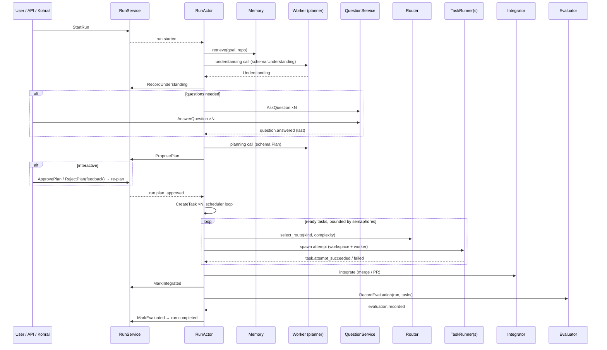

# 05 — Orchestration (`kevin-orchestrator`)

The orchestrator owns the `Run`, `Task` and `Question` aggregates
([02](./02-domain-model.md)), the `RunActor` process manager, the scheduler and
the `TaskRunner`. It is the only crate that coordinates across aggregates. It
depends on `kevin-domain`, `kevin-store`, `kevin-bus`, `kevin-router`,
`kevin-memory`, `kevin-worker`, `kevin-workspace`, `kevin-evaluator`,
`kevin-config`, `kevin-telemetry`. Nothing it depends on depends on it.

Worker interaction uses only the abstract `Worker` / `WorkerHandle` /
`WorkerEvent` / `TaskAttemptRequest` contract from [04](./04-workers.md).

## 1. Application services

Each service is a thin command handler: load stream → rehydrate → call the
aggregate → append with `expected_version` → publish. No business rules live in
services.

```rust
pub struct RunService { store: Arc<dyn EventStore>, bus: Arc<dyn EventBus>, clock: Arc<dyn Clock> }
impl RunService {
    pub async fn start_run(&self, cmd: StartRun) -> Result<RunId, AppError>;
    pub async fn record_understanding(&self, cmd: RecordUnderstanding) -> Result<(), AppError>;
    pub async fn propose_plan(&self, cmd: ProposePlan) -> Result<(), AppError>;
    pub async fn approve_plan(&self, cmd: ApprovePlan) -> Result<(), AppError>;
    pub async fn reject_plan(&self, cmd: RejectPlan) -> Result<(), AppError>;
    pub async fn note_task_terminal(&self, cmd: NoteTaskTerminal) -> Result<(), AppError>;
    pub async fn mark_integrated(&self, cmd: MarkIntegrated) -> Result<(), AppError>;
    pub async fn mark_evaluated(&self, cmd: MarkEvaluated) -> Result<(), AppError>;
    pub async fn cancel_run(&self, cmd: CancelRun) -> Result<(), AppError>;
    pub async fn fail_run(&self, cmd: FailRun) -> Result<(), AppError>;
}
pub struct TaskService { /* same deps */ }
impl TaskService {
    pub async fn create_task(&self, cmd: CreateTask) -> Result<TaskId, AppError>;
    pub async fn route_task(&self, cmd: RouteTask) -> Result<(), AppError>;
    pub async fn start_attempt(&self, cmd: StartAttempt) -> Result<AttemptId, AppError>;
    pub async fn record_progress(&self, cmd: RecordProgress) -> Result<(), AppError>;
    pub async fn request_input(&self, cmd: RequestInput) -> Result<(), AppError>;
    pub async fn provide_input(&self, cmd: ProvideInput) -> Result<(), AppError>;
    pub async fn succeed_attempt(&self, cmd: SucceedAttempt) -> Result<(), AppError>;
    pub async fn fail_attempt(&self, cmd: FailAttempt) -> Result<(), AppError>;
    pub async fn retry_task(&self, cmd: RetryTask) -> Result<(), AppError>;
    pub async fn cancel_task(&self, cmd: CancelTask) -> Result<(), AppError>;
    pub async fn skip_task(&self, cmd: SkipTask) -> Result<(), AppError>;
}
pub struct QuestionService { /* same deps */ }
impl QuestionService {
    pub async fn ask(&self, cmd: AskQuestion) -> Result<QuestionId, AppError>;
    pub async fn answer(&self, cmd: AnswerQuestion) -> Result<(), AppError>;
    pub async fn expire(&self, cmd: ExpireQuestion) -> Result<(), AppError>;
}
pub enum AppError { NotFound, Domain(DomainError), Conflict, Store(StoreError), Duplicate(CommandResult) }
```

Every command struct has `command_id: CommandId`, and `actor: Actor`.

- **Idempotency:** the handler first checks `core.processed_commands`; a hit
  returns the stored `CommandResult` (`AppError::Duplicate` is mapped to the
  original success result by callers). The `processed_commands` row is
  inserted in the same transaction as the event append.
- **OCC retry:** on `VersionConflict` the handler reloads and re-applies the
  command at most 3 times with 10/50/200 ms jittered backoff. Conflicts after
  that surface as `AppError::Conflict` and the saga treats them as transient.
- **Publishing:** `store.append()` returns the persisted `EventEnvelope`s;
  the service publishes them to `bus` after commit. Bus publish failure is
  logged, never fails the command (cross-process consumers catch up from the
  store).

## 2. `RunActor`

One tokio task per non-terminal run.

```rust
pub struct RunActor {
    run_id: RunId,
    mailbox: mpsc::Receiver<SagaInput>,    // events for this run + control messages
    token: CancellationToken,              // child of the runtime root token
    tasks: JoinSet<TaskRunnerOutcome>,     // one entry per running attempt
    runners: HashMap<AttemptId, RunnerHandle { token, task_id }>,
    deps: Arc<OrchestratorDeps>,           // services, router, memory, workers, workspaces, evaluator, config, clock
    state: SagaView,                       // projection of run/task/question state, rebuilt from stream
}
pub enum SagaInput { Event(EventEnvelope<DomainEvent>), Drain, Shutdown, Tick }
pub struct RunSupervisor { actors: DashMap<RunId, ActorHandle>, root_token: CancellationToken, admission: AtomicBool }
```

- **Spawn:** `RunSupervisor` spawns an actor on `run.started` and, at boot,
  for every run found in `orch.run_overview` with non-terminal status (then
  verified by replaying its stream). Boot replays each stream into `SagaView`
  and resumes at the first unsatisfied saga step ([02 § Process manager](./02-domain-model.md)).
- **Mailbox:** the supervisor subscribes once to the bus and routes envelopes
  by `correlation_id` into the right actor's mailbox (bounded 1024; a full
  mailbox applies back-pressure to the bus subscriber task, never drops).
- **Token tree:** `root → run → task attempt`. `CancelRun` cancels the run
  token; `TaskRunner`s observe their child token, cancel the worker (SIGTERM →
  SIGKILL), and report `TaskAttemptFailed{class: Cancelled}`.
- **Drain:** `SagaInput::Drain` sets `admission=false` on the supervisor and
  makes actors stop scheduling new attempts; running attempts continue until
  `shutdown_grace_period`. `SagaInput::Shutdown` then cancels remaining tokens
  and the actor records `TaskAttemptFailed{class: Transient, message:
  "runtime_shutdown"}` for each before exiting.
- **`runtime_restarted`:** at boot, before spawning actors, the supervisor
  scans for attempts whose last event is `task.attempt_started` / `task.progressed`
  / `task.input_requested` and issues `FailAttempt{class: RuntimeRestarted,
  message: "runtime_restarted"}`. They are never resumed or replayed; the task
  may then be retried by normal policy (a retry is a *new* attempt with a fresh
  workspace) unless the run is in Kohral mode, where the turn fails
  (see § 6).
- **Tick:** a 5 s timer drives question expiry, wall-clock budgets and
  progress-throttle flushes.

## 3. Pipeline



### 3.1 Intake

`StartRun { goal: Goal, mode, budget: Option<Budget>, requested_by,
role_overrides: BTreeMap<String, ModelAlias> }`.

- `Goal.text` trimmed; attachments copied under
  `data_dir/runs/<run_id>/attachments/` and registered as `ArtifactRef`s.
- `Goal.cwd` canonicalised; repo detection: `.jj` → `RepoKind::Jj`, `.git` →
  `Git`, else `None` (workspace strategy then resolves to `in_place`).
- Budget = `config.budget` defaults merged with the command's overrides; Kohral
  mode caps `max_wall` to `kohral.run_timeout`.
- `role_overrides` replaces `[roles]` entries **for this run only**, by role
  name. `planner`/`clarifier`/`integrator` change the fixed route those phases
  use, and `judge` covers an `Evaluate` task in the plan; `default` replaces the
  router's fallback, so every other task the plan produces runs on the requested
  alias instead of being Thompson-sampled. The override is applied where the
  route is chosen (`role_route`, `route_for`), so it survives retries and a
  runtime restart; an alias missing from `[models]` fails the run `no_route`
  with the same message a bad `roles.*` produces.
- Not yet covered: the **run-level** evaluation at the end of a run goes through
  `EvaluatorPort::evaluate_run`, which picks its judge from `roles.judge` and
  the anti-gaming candidate list ([06](./06-memory-and-learning.md) §3) without
  seeing the run. Honouring `role_overrides.judge` there means passing the
  override through the port into `kevin-evaluator`'s judge selection; until then
  a Kohral turn's model choice applies to the work, not to the final judging.
- Memory retrieval (`kevin-memory::retrieve`): query = goal text + repo name +
  top-level file listing summary; `top_k` from config, partitioned
  `lessons ≥ 3`, `preferences ≥ 2`, `run_summaries ≤ 3`. Injected into the
  planner call as a `<kevin-memory>` section capped at `memory.context_max_tokens`
  (2 500, estimate chars/4); items ranked by similarity × importance decay
  ([06 §1.6](./06-memory-and-learning.md)). In Kohral mode a `SystemContextProvider`
  hook prepends the platform briefing ([08 §5.1](./08-kohral-runtime.md)).

### 3.2 Understanding

Role `planner` (`roles.planner`, `roles.effort.planner`). Worker called with
`TaskAttemptRequest{ kind: Understand, workspace: in-place read-only (claude
`permission_mode=plan`, codex `-s read-only`), output_schema: UNDERSTANDING }`.

```json
{
  "$id": "kevin.understanding.v1",
  "type": "object", "additionalProperties": false,
  "required": ["objective","assumptions","risks","success_criteria","proposed_questions","complexity","suggested_task_kinds"],
  "properties": {
    "objective": {"type":"string","maxLength":2000},
    "assumptions": {"type":"array","items":{"type":"string"}},
    "risks": {"type":"array","items":{"type":"string"}},
    "success_criteria": {"type":"array","minItems":1,"items":{"type":"string"}},
    "proposed_questions": {"type":"array","maxItems":10,"items":{
      "type":"object","additionalProperties":false,
      "required":["text","options","why_it_matters","confidence_if_unasked"],
      "properties":{
        "text":{"type":"string"},
        "options":{"type":"array","maxItems":4,"items":{"type":"object","required":["label"],
            "properties":{"label":{"type":"string"},"description":{"type":"string"},"recommended":{"type":"boolean"}}}},
        "multi_select":{"type":"boolean"},
        "why_it_matters":{"type":"string"},
        "confidence_if_unasked":{"type":"number","minimum":0,"maximum":1}
      }}},
    "complexity": {"enum":["low","medium","high"]},
    "suggested_task_kinds": {"type":"array","items":{"type":"string"}},
    "context_refs": {"type":"array","items":{"type":"string"}}
  }
}
```

Question selection rules (config `[orchestrator]` keys default values shown;
see 03-config-schema `[orchestrator]`: `question_confidence_threshold = 0.7`,
`max_questions_per_run = 4`):

- A proposed question becomes a `Question` iff `confidence_if_unasked <
  threshold`. Keep at most `max_questions_per_run`, lowest confidence first.
- Interactive mode: `policy = Block`.
- Headless / Kohral mode: `policy = DefaultAfter{0s}` when a `recommended`
  option exists (answered immediately by `default`), otherwise the question is
  still asked with `DefaultAfter{orchestrator.question_default_timeout = 10m}`
  (answerable via CLI/API); on expiry with no default the run fails
  `unanswered_question`. Kohral mode never waits: no default → the planner
  proceeds with its best guess and records it as an assumption
  ([08 §3](./08-kohral-runtime.md)).
- Dropped proposals (above threshold) are recorded in `Understanding.assumptions`
  as "Assumed: <recommended option>" so the planner sees them.

### 3.3 Clarification

End-to-end protocol:

1. `QuestionService::ask` → `question.asked` → projection `orch.question_inbox`
   → API `GET /api/v1/questions?run_id=`, SSE `question.asked`, TUI inbox
   (Kohral mode: never asked, defaults applied, see [08 §3](./08-kohral-runtime.md)).
2. Answer via `POST /api/v1/questions/{qid}/answer` or the TUI. `AnswerQuestion{selected[], free_text?,
   answered_by}`; validation: selected ⊆ options unless free text allowed.
3. Questions of one run are asked as a batch (one event per question, same
   `causation_id`), displayed together; the saga waits for *all* open
   questions before planning. Questions raised by a running task
   (`TaskInputRequested`) are answered the same way and resume only that task.
4. Expiry is driven by `Tick` (`ExpireQuestion` when `now ≥ asked_at +
   timeout`).

### 3.4 Planning

Role `planner`, input = goal + understanding + answers + memory + repo summary.

```json
{
  "$id": "kevin.plan.v1",
  "type":"object","additionalProperties":false,
  "required":["tasks","rationale"],
  "properties":{
    "tasks":{"type":"array","minItems":1,"maxItems":24,"items":{
      "type":"object","additionalProperties":false,
      "required":["id","title","kind","instructions","acceptance_criteria","depends_on"],
      "properties":{
        "id":{"type":"string","pattern":"^t[0-9]{1,3}$"},
        "title":{"type":"string","maxLength":120},
        "kind":{"enum":["research","implement","test","review","refactor","debug","write","ops","custom"]},
        "custom_kind":{"type":"string"},
        "instructions":{"type":"string"},
        "acceptance_criteria":{"type":"array","minItems":1,"items":{"type":"string"}},
        "depends_on":{"type":"array","items":{"type":"string"}},
        "inputs":{"type":"array","items":{"type":"string"}},
        "suggested_tier":{"enum":["fast","balanced","frontier"]},
        "parallel_safe":{"type":"boolean","default":true},
        "workspace_policy":{"enum":["isolated","shared","read_only"],"default":"isolated"},
        "optional":{"type":"boolean","default":false},
        "allow_push":{"type":"boolean","default":false},
        "output_schema":{"type":"object"}
      }}},
    "edges":{"type":"array","items":{"type":"array","items":{"type":"string"},"minItems":2,"maxItems":2}},
    "rationale":{"type":"string"}
  }
}
```

Validation (`PlanValidator`, pure, in `kevin-domain`):
acyclic (Kahn), `depends_on`/`edges` reference known ids, `tasks.len() ≤
config.orchestrator.max_tasks_per_run (default 24)`, kinds known,
`custom` requires `custom_kind`, `shared` workspace tasks are never scheduled
concurrently with another `shared`/`isolated` writer on the same repo (they
are serialised). Invalid plan → one repair call with the validation errors,
then `FailRun{reason: invalid_plan}`.

Approval: interactive runs enter `awaiting_plan_approval`; `ApprovePlan` or
`RejectPlan{feedback}` (re-plan with feedback, at most
`orchestrator.plan_revision_limit = 2`). Headless/Kohral or `kevin.auto_approve_plans=true` → auto-approved
(`by: "auto"`).

### 3.5 Execution

**Scheduler** (inside `RunActor`):

```text
loop on SagaInput:
  ready = tasks where status == pending && all deps succeeded
  for t in ready (stable order: plan order):
     if run.running_attempts >= budget.max_parallel → break
     route = router.select(kind, complexity, tier_hint, exclude = failed routes of t)
     TaskService::route_task(t, route)             → task.routed
     acquire global semaphore + per-worker-kind semaphore (non-blocking try; else stay routed)
     workspace = workspaces.create(run, t, policy)  → attempt workspace
     attempt = TaskService::start_attempt(...)      → task.attempt_started
     spawn TaskRunner(attempt, permits, workspace, worker)
```

Permits are released when the runner finishes. A task in `routed` without a
permit is re-tried on every `Tick`/terminal event.

**TaskRunner**:

```mermaid
stateDiagram-v2
    [*] --> Starting
    Starting --> Streaming: worker.start() ok
    Starting --> Failed: spawn error (Transient)
    Streaming --> Streaming: WorkerEvent (log + throttled task.progressed)
    Streaming --> AwaitingInput: WorkerEvent::InputRequested → AskQuestion + RequestInput
    AwaitingInput --> Streaming: question.answered → ProvideInput → resume worker session
    Streaming --> Validating: WorkerEvent::Final
    Validating --> Succeeded: acceptance/schema ok → collect artifacts
    Validating --> Failed: schema invalid after repair (Permanent)
    Streaming --> Failed: WorkerEvent::Failed / timeout / budget / cancel
    Succeeded --> [*]
    Failed --> [*]
```

Folding rules: every `WorkerEvent` → `orch.task_log` row (`seq` monotonic per
attempt). `RecordProgress` at most once per `orchestrator.progress_interval` (10 s) or on
milestones (tool call count ×25, usage delta > 50k tokens). `Usage` events are
accumulated; cost computed via router price table when absent. Artifacts:
workspace diff (`git diff base..HEAD` / `jj diff`), files listed by the
worker's structured output, transcript path.

**Failure classification & retry policy**

| Signal | Class | Action |
|---|---|---|
| worker exit non-zero with rate-limit/overloaded/network text, spawn error, timeout < 2 attempts | Transient | `RetryTask` (new route allowed, `exclude` previous) while attempts < max |
| output schema invalid after 1 repair; worker refused; invalid spec | Permanent | `fail` task; dependents `SkipTask{reason: dependency_failed}`; run continues if `task.spec.optional` else `FailRun{task_failed}` |
| task/run budget exceeded | Budget | fail task; run emits `BudgetExhausted` and fails |
| token cancelled | Cancelled | fail attempt, no retry |
| boot terminalisation | RuntimeRestarted | fail attempt; retry allowed (non-Kohral) |

A task whose every attempt failed marks the run `failed` unless
`spec.optional` (plan field `optional`, default false).

**Input requests:** `WorkerEvent::InputRequested{question}` → `AskQuestion{task_id}`
+ `RequestInput`; the runner keeps the worker session id; on answer it resumes
the worker (`--resume`/`resume <id>`) with the answer as the next message; if
the worker cannot resume, the attempt fails `Transient` and the retry includes
the answer in the prompt.

### 3.6 Integration

After all tasks terminal with ≥1 success:

- `workspace.integration = "pr"`: integrator role (`roles.integrator`) runs on a
  fresh integration workspace: merge/rebase every succeeded task branch onto
  base, run the repo's checks if declared (`.kevin/kevin.toml
  [checks] commands = [...]`), open one PR (or one per task when
  `workspace.pr_per_task = true`) using `gh`/`jj git push`; artifacts =
  PR URLs + final diff.
- `"merge"`: same, but merge into the base branch locally; `"none"`: branches
  left; artifacts = branch names.
- Merge conflicts → spawn a `Task{kind: Integrate}` with the conflict list
  (routed via `roles.integrator`); if it fails → `FailRun{integration_failed}`.
- `MarkIntegrated{artifacts, summary}` → `run.integrated`.

### 3.7 Evaluation hand-off

On `run.integrated` the actor calls
`evaluator.evaluate_run(run_id, task_ids)`; the evaluator issues
`RecordEvaluation` commands (details [06](./06-memory-and-learning.md)). On
`evaluation.recorded{subject: Run}` → `MarkEvaluated` → `run.completed`.
Evaluation failure never fails the run: after `orchestrator.evaluation_timeout` (10 m) the
actor completes the run with `evaluation: skipped` and logs a warning.

## 4. Budgets, timeouts, cancellation

Enforcement points:

| Where | Check |
|---|---|
| before `StartAttempt` | `run.usage.cost_usd + estimate(task) ≤ budget.max_usd`; wall remaining > 1 min |
| on every `Usage` event | task and run totals; exceed → cancel attempt, `FailAttempt{Budget}`, run `BudgetExhausted` |
| `Tick` | run wall-clock, task wall-clock (`default_task_wall`), question timeouts |
| `RetryTask` | attempts < `budget.max_attempts` |

| Timeout | Default | Source |
|---|---|---|
| planner/judge worker call | 15 m | `roles` call timeout (config `orchestrator.role_call_timeout`) |
| task attempt | 30 m | `budget.default_task_wall` |
| run | 2 h | `budget.default_run_wall` |
| question (headless) | 10 m | `orchestrator.question_default_timeout` |
| worker kill grace | 10 s | worker supervisor |
| shutdown drain | 30 s | `kevin.shutdown_grace_period` |

Cancellation: `CancelRun` → token cancel → runners fail attempts `Cancelled`
→ `run.cancelled`; workspaces cleaned per `workspace.cleanup`.

Concurrency invariants: one running attempt per task; `running_attempts ≤
budget.max_parallel` per run and `≤ budget.max_parallel_tasks` globally;
`shared` workspace tasks serialised per repo; all aggregate writes go through
services (OCC) — the actor never caches aggregate versions.

## 5. Headless / Kohral mode differences

| Aspect | Interactive | Headless | Kohral |
|---|---|---|---|
| questions | block | default/timeout (answerable via CLI/API) | defaults, never waits; no default → best guess recorded as assumption |
| plan approval | required | auto | auto |
| runtime_restarted | retry allowed | retry allowed | turn fails, no retry (contract) |
| integration | per config | per config | `none` unless configured (repo may be absent) |
| result | artifacts + summary | same | summary becomes the turn `output`; usage → turn usage |

## 6. Test plan (fake worker, injected clock)

| Scenario | Expected event sequence (abridged) |
|---|---|
| happy_path_no_questions | run.started → understanding_completed → plan_proposed → plan_approved(auto) → task.created×2 → routed/attempt_started/attempt_succeeded ×2 → run.integrated → evaluation.recorded → run.completed |
| questions_then_plan | … understanding_completed → question.asked×2 → question.answered×2 → plan_proposed … |
| headless_default_answers | question.asked → question.answered{answered_by: default} immediately |
| question_expired_no_default | question.asked → question.expired → run.failed{unanswered_question} |
| plan_rejected_then_revised | plan_proposed → plan_rejected → plan_proposed → plan_approved |
| plan_invalid_cycle_repaired | planner returns cycle → repair call → valid plan |
| plan_invalid_twice | → run.failed{invalid_plan} |
| dag_parallelism_respected | 4 ready tasks, max_parallel=2 → never >2 concurrent attempt_started without terminal |
| dependency_skip | t1 fails permanently → t2 task.skipped{dependency_failed} → run.failed{task_failed} |
| transient_retry_reroutes | attempt_failed{Transient} → task.retried → task.routed(with different alias) → succeeded |
| max_attempts_exhausted | 2 failures → task failed → run.failed |
| budget_exhausted_mid_run | usage events exceed max_usd → attempt cancelled → run.budget_exhausted → run.failed |
| task_input_request | attempt → task.input_requested → question.asked → answered → task.input_provided → succeeded |
| cancel_run_kills_children | run.cancelled; every running attempt attempt_failed{Cancelled}; fake worker observed SIGTERM |
| runtime_restarted_on_boot | store seeded with attempt_started; boot → attempt_failed{RuntimeRestarted} → retried (non-Kohral) / run.failed (Kohral) |
| shutdown_drain | Drain → no new attempt_started; running finish within grace; Shutdown → remaining attempt_failed{runtime_shutdown} |
| integration_conflict_task | integrator conflict → task.created{Integrate} → succeeded → run.integrated |
| evaluation_timeout_completes_run | evaluator hangs → run.completed with evaluation skipped |
| idempotent_command_replay | same command_id twice → one event set, same result |
| occ_conflict_retry | concurrent answers on same run → both applied, no lost update |
