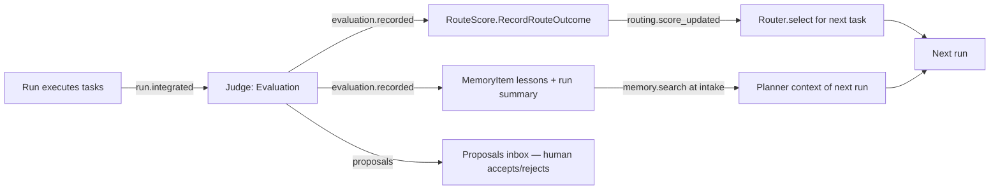

# 06 — Memory, routing, and evaluation (the learning loop)

Three crates implement "Kevin improves over time":

| Crate | Context | Responsibility |
|---|---|---|
| `kevin-memory` | Memory | Persistent retrieval memory (Postgres + pgvector), local embeddings, lessons, summaries, intake retrieval. |
| `kevin-router` | Routing | Model catalog, task-kind taxonomy, `RouteScore` learning, route selection (Thompson sampling). |
| `kevin-evaluator` | Evaluation | Rubrics, judge calls (through `kevin-worker`), `Evaluation` records, proposals, auto-apply policy. |

Names follow [02-domain-model](./02-domain-model.md) (`MemoryItem`, `RouteScore`,
`Evaluation`, events `memory.*`, `routing.score_updated`, `evaluation.*`) and
config sections `[memory]`, `[routing]`, `[evaluation]` from
[03-config-schema](./03-config-schema.md). Worker invocation details are in
[04-workers](./04-workers.md); when the saga issues the commands is in
[05-orchestration](./05-orchestration.md).



---

## 1. Memory (`kevin-memory`)

### 1.1 Schema (`memory` schema, migration `0004_memory.sql`)

```sql
CREATE EXTENSION IF NOT EXISTS vector;
CREATE SCHEMA IF NOT EXISTS memory;

CREATE TABLE memory.memory_items (
    id               uuid PRIMARY KEY,                       -- MemoryItemId (v7)
    kind             text NOT NULL CHECK (kind IN ('lesson','preference','fact','run_summary','artifact_summary')),
    content          text NOT NULL CHECK (length(content) <= 8000),
    tags             text[] NOT NULL DEFAULT '{}',
    source           jsonb NOT NULL DEFAULT '{}',            -- {run_id?, task_id?, evaluation_id?, actor}
    scope            text NOT NULL DEFAULT 'global',         -- 'global' | 'repo:<canonical repo id>'
    importance       real NOT NULL DEFAULT 0.5 CHECK (importance BETWEEN 0 AND 1),
    embedding        vector(384),                            -- NULL when embedder = none or pending
    embedding_model  text,                                   -- e.g. 'BAAI/bge-small-en-v1.5'
    tsv              tsvector GENERATED ALWAYS AS (to_tsvector('english', content)) STORED,
    created_at       timestamptz NOT NULL DEFAULT now(),
    superseded_by    uuid REFERENCES memory.memory_items(id),
    forgotten_at     timestamptz                              -- forget: row kept for provenance, content set to '' and embedding NULLed
);
CREATE INDEX memory_items_embedding_hnsw ON memory.memory_items USING hnsw (embedding vector_cosine_ops)
    WITH (m = 16, ef_construction = 64);
CREATE INDEX memory_items_tsv_gin ON memory.memory_items USING gin (tsv);
CREATE INDEX memory_items_tags_gin ON memory.memory_items USING gin (tags);
CREATE INDEX memory_items_scope_kind ON memory.memory_items (scope, kind) WHERE forgotten_at IS NULL AND superseded_by IS NULL;

-- read model fed by memory.* events (kept in sync by the memory projection)
CREATE VIEW memory.lessons_view AS
  SELECT id, content, tags, scope, importance, source->>'run_id' AS run_id, created_at
  FROM memory.memory_items WHERE kind = 'lesson' AND forgotten_at IS NULL AND superseded_by IS NULL;
```

`repo id` = sha256 of the canonical origin URL when available, else of the
absolute repo root path. `memory.dimensions` (config) must equal the `vector(N)`
width; changing the embedding model requires `kevin memory reindex` (see 1.7),
which rewrites `embedding`/`embedding_model` in batches inside a migration-free
maintenance command (the column width change itself is a numbered migration).

### 1.2 Embedder

```rust
#[async_trait]
pub trait Embedder: Send + Sync {
    fn model_name(&self) -> &str;
    fn dimensions(&self) -> usize;
    /// Returns one vector per input, same order. Inputs are pre-truncated to max_input_chars.
    async fn embed_batch(&self, inputs: &[String]) -> Result<Vec<Vec<f32>>, EmbedError>;
}

pub struct FastEmbedEmbedder { /* fastembed::TextEmbedding behind Arc<Mutex<_>>, semaphore */ }
pub struct NoopEmbedder;   // dimensions() = configured; embed_batch returns Err(EmbedError::Disabled)
```

- `FastEmbedEmbedder` uses the `fastembed` crate (ONNX Runtime, CPU), model
  `BAAI/bge-small-en-v1.5` (384 dims), model files cached under
  `<data_dir>/embeddings/`. Inference runs on `spawn_blocking` guarded by a
  `Semaphore(concurrency.blocking_threads)`; batches ≤ 32 inputs; inputs
  truncated to 2 000 chars (bge-small has a 512-token window).
- First use downloads the model (logged at info, ~130 MB). `kevin memory doctor`
  pre-fetches it; Kohral image pre-bakes it at build time.
- `embedder = "none"` → `NoopEmbedder`: items are stored with `embedding NULL`
  and search degrades to full-text + importance only.
- HTTP embedders (Voyage/OpenAI) are a later extension behind the same trait;
  not in v1 because Kevin holds no provider keys.

### 1.3 `MemoryStore` API

```rust
pub struct MemoryStore { pool: PgPool, embedder: Arc<dyn Embedder>, cfg: MemoryCfg }

pub struct StoreRequest { pub kind: MemoryKind, pub content: String, pub tags: Vec<String>,
    pub scope: Scope, pub source: MemorySource, pub importance: f32 }
pub struct SearchQuery { pub text: String, pub kinds: Vec<MemoryKind>, pub tags_any: Vec<String>,
    pub scope: ScopeFilter /* Global | Repo(id) | RepoAndGlobal(id) */, pub top_k: usize, pub min_similarity: f32 }
pub struct Hit { pub item: MemoryItem, pub similarity: f32, pub lexical: f32, pub score: f32 }

impl MemoryStore {
    pub async fn store(&self, req: StoreRequest) -> Result<MemoryItemId>;            // embeds, inserts, emits memory.item_stored
    pub async fn supersede(&self, old: MemoryItemId, req: StoreRequest) -> Result<MemoryItemId>; // new item + link, emits memory.item_superseded
    pub async fn forget(&self, id: MemoryItemId, by: Actor) -> Result<()>;            // sets forgotten_at, blanks content, NULLs embedding; emits memory.item_forgotten
    pub async fn search(&self, q: SearchQuery) -> Result<Vec<Hit>>;
    pub async fn reindex(&self, batch: usize, progress: impl FnMut(usize,usize)) -> Result<()>;
}
```

`store` is the handler for `StoreMemoryItem`; it redacts (1.8), embeds (or
defers when the embedder errors: item stored with `embedding NULL` and a
`memory_reindex_pending` metric increments), inserts, and appends
`memory.item_stored` through the event store in the same transaction as the
insert (the memory projection is the table itself — this is the one context
where the aggregate table *is* the read model, documented as a deliberate
simplification).

### 1.4 Hybrid ranking

For a query `q` (embedded once) restricted by scope/kinds/tags, candidates are
the union of the top 4·k nearest by cosine (HNSW) and the top 4·k by
`ts_rank_cd(tsv, websearch_to_tsquery(q))`. Each candidate scores:

```
similarity = 1 - cosine_distance                     -- 0..1 (0 when embedding NULL)
lexical    = ts_rank_cd(...) normalised to 0..1 over the candidate set
decay      = 0.5 ^ (age_days / memory.decay_half_life_days)   -- 90 d default
score      = 0.60 * similarity + 0.25 * lexical + 0.15 * (importance * (0.5 + 0.5 * decay))
```

Candidates with `similarity < memory.min_similarity` **and** `lexical == 0`
are dropped; results are sorted by `score`, deduplicated on
`superseded_by` chains (only the head survives), and truncated to `top_k`.
Decay affects ranking only; nothing is deleted by age.

### 1.5 What is stored automatically

| Kind | When | Who writes | Content |
|---|---|---|---|
| `run_summary` | `run.completed` / `run.failed` (if `store_run_summaries`) | summariser (role `default`, effort low) | ≤ 600 chars: goal, what was done, outcome, notable decisions, repo id |
| `artifact_summary` | `task.attempt_succeeded` with artifacts (if `store_artifact_summaries`) | summariser | ≤ 300 chars per artifact: what it is, where, why |
| `lesson` | `evaluation.recorded` (`lessons[]`) | evaluator (auto-apply `memory`) | one actionable sentence each, tags = [task_kind, repo id, worker] |
| `preference` | `question.answered` by a human | preference extractor (same summariser call, schema below) | "User prefers X when Y" — only when the answer generalises |
| `fact` | explicit `kevin memory add --kind fact` or `Remember` command | user/operator | free text |

Summariser contract (single call, structured output, see 04 for the mechanism):

```json
{ "type": "object", "required": ["summary", "preferences"],
  "properties": {
    "summary": { "type": "string", "maxLength": 600 },
    "artifact_summaries": { "type": "array", "items": { "type": "object",
        "required": ["artifact_id","summary"], "properties": { "artifact_id": {"type":"string"}, "summary": {"type":"string","maxLength":300} } } },
    "preferences": { "type": "array", "items": { "type": "object",
        "required": ["statement","confidence"], "properties": {
          "statement": {"type":"string","maxLength":200}, "confidence": {"type":"number","minimum":0,"maximum":1},
          "scope": {"type":"string","enum":["global","repo"]} } } }
  } }
```

Prompt (system): "You write terse memory records for an agent runtime. Summarise
what happened, never what was planned. Extract a preference only if the human's
answer would change how a *future, different* task should be done; otherwise
return an empty list." Preferences with `confidence < 0.7` are discarded.
Importance defaults: lesson 0.5 (raised to 0.7 when a second evaluation
corroborates it — the dedup/supersede path in 3.4), preference 0.8,
run_summary 0.5, artifact_summary 0.3, fact 0.6.

### 1.6 Retrieval at intake

Called by the saga on `run.started` (before the planner call) and again before
each `implement`/`debug`/`refactor` task attempt (task-scoped query):

1. Query text = goal text (+ task title/instructions for task-scoped) truncated
   to 2 000 chars; `scope = RepoAndGlobal(repo id)`; `kinds = [lesson,
   preference, fact, run_summary]` for intake, `[lesson, preference,
   artifact_summary]` for tasks; `top_k = memory.top_k`.
2. The hits are rendered into a context block capped at **2 500 tokens**
   (estimated 4 chars/token; drop lowest-score first):

```
<kevin-memory>
Lessons (most relevant first):
- [L-3f2a | repo | 0.81] Run cargo fmt before opening PRs in this repo.
Preferences:
- [P-91cd | global | 0.77] User prefers jj bookmarks named type/short-description.
Past runs:
- [R-0ab1 | 2026-08-12] Added event store crate; tests via testcontainers.
</kevin-memory>
```

3. Item ids are short prefixes so the planner/judge can cite them; the block is
   passed as `context.memory` in `TaskAttemptRequest` and lands in the worker's
   appended system prompt. Retrieval usage is recorded on the run as
   `context_refs[]` in `run.understanding_completed`.

### 1.7 CLI

| Command | Behaviour |
|---|---|
| `kevin memory search "<text>" [--kind k] [--repo] [--top-k n]` | prints ranked hits with score breakdown |
| `kevin memory add --kind fact|preference "<text>" [--tag t] [--global]` | `StoreMemoryItem` with actor = user |
| `kevin memory forget <id>` | soft delete |
| `kevin memory reindex [--model m]` | re-embeds all non-forgotten items in batches of 64; resumable (`WHERE embedding_model IS DISTINCT FROM $1`) |
| `kevin memory doctor` | embedder model present/downloadable, dimension check, HNSW index present, counts per kind |
| `kevin lessons [--repo]` | reads `memory.lessons_view` |

### 1.8 Privacy and redaction

- Redact **by allowlist**: only `content`, `tags`, and the fields listed in
  `MemorySource` are stored; worker transcripts are never stored in memory
  (they live in `orch.task_log` with their own retention).
- Before storing, content passes `kevin_telemetry::redact::scrub()` (same
  patterns as log redaction: API keys, bearer tokens, `AKIA…`, private key
  blocks, URLs with userinfo) → replaced with `[REDACTED]`; if more than 20 % of
  the text is redacted the item is dropped and a warning logged.
- `scope = repo:<id>` items are only retrieved for that repo; `global` items are
  retrieved everywhere. Kohral mode forces `scope = repo:<agent id>`.
- `kevin memory export --json` / `import` exist for backup; export excludes
  embeddings by default.

---

## 2. Routing (`kevin-router`)

### 2.1 Catalog and taxonomy

- `ModelCatalog::from_config(&KevinConfig)` validates aliases (worker enabled,
  `pi` has `provider`, prices ≥ 0) and snapshots them into
  `routing.model_aliases` with a `catalog_version` (sha256 of the canonical
  TOML of `[models]`). Every `task.routed` event and `route_outcomes` row
  records the `catalog_version` so leaderboards survive config edits.
- `TaskKind` and `Complexity {Low, Medium, High}` come from `kevin-domain`.
  `routing.kinds.<kind>.candidates` define the candidate set per kind; kinds
  with no entry fall back to `[roles].default` (policy `fixed`, recorded as
  `policy = "fallback"`). `understand/clarify/plan/evaluate/integrate` always
  use `[roles]` and bypass the router.

```sql
CREATE SCHEMA IF NOT EXISTS routing;
CREATE TABLE routing.model_aliases (
    catalog_version text NOT NULL, alias text NOT NULL, worker text NOT NULL, model text NOT NULL,
    tier text NOT NULL, input_usd_per_m numeric, output_usd_per_m numeric, tags text[] NOT NULL DEFAULT '{}',
    extra jsonb NOT NULL DEFAULT '{}', first_seen timestamptz NOT NULL DEFAULT now(),
    PRIMARY KEY (catalog_version, alias));

CREATE TABLE routing.route_scores (            -- RouteScore aggregate state (snapshot; events are the truth)
    task_kind text NOT NULL, alias text NOT NULL,
    attempts int NOT NULL DEFAULT 0, successes int NOT NULL DEFAULT 0,
    alpha real NOT NULL, beta real NOT NULL,       -- Beta prior params, seeded by tier (2.3)
    quality_ema real,                              -- 0..1, EMA of judge overall
    mean_cost_usd numeric, mean_wall_ms bigint,
    last_used timestamptz, version bigint NOT NULL DEFAULT 0,
    PRIMARY KEY (task_kind, alias));

CREATE TABLE routing.route_outcomes (          -- append-only, one per task attempt with a terminal state
    id uuid PRIMARY KEY, run_id uuid NOT NULL, task_id uuid NOT NULL, attempt_id uuid NOT NULL,
    task_kind text NOT NULL, alias text NOT NULL, catalog_version text NOT NULL,
    success boolean NOT NULL, quality real, cost_usd numeric, wall_ms bigint,
    failure_class text, recorded_at timestamptz NOT NULL DEFAULT now());
CREATE INDEX route_outcomes_kind_alias ON routing.route_outcomes (task_kind, alias, recorded_at DESC);
```

### 2.2 Selection API

```rust
pub struct SelectRouteQuery { pub kind: TaskKind, pub complexity: Complexity, pub tags: Vec<String>,
    pub exclude: Vec<ModelAlias>, pub budget_left_usd: Option<Decimal>, pub rng_seed: Option<u64> }
pub struct CandidateScore { pub alias: ModelAlias, pub sampled_success: f32, pub quality: f32,
    pub norm_cost: f32, pub norm_latency: f32, pub score: f32, pub samples: u32, pub excluded_reason: Option<String> }
pub struct RouteSelection { pub route: Route, pub policy: Policy /* Thompson|EpsilonGreedy|Fixed|Fallback */,
    pub candidates: Vec<CandidateScore>, pub catalog_version: String }

impl Router {
    pub async fn select(&self, q: SelectRouteQuery) -> Result<RouteSelection, RoutingError>;
    pub async fn record_outcome(&self, cmd: RecordRouteOutcome) -> Result<()>;   // see 2.4
}
```

Algorithm (`policy = thompson`, default):

1. Candidates = `routing.kinds.<kind>.candidates` minus `exclude` minus aliases
   whose worker failed `doctor()` at boot minus aliases whose
   `mean_cost_usd > budget_left_usd` (when known). Empty → `[roles].default`
   with `policy = Fallback`; if that is excluded too → `RoutingError::NoRoute`
   (task fails `Permanent`).
2. Tier preference: `prefer_tier_for_complexity[complexity]` adds +0.10 to
   matching-tier candidates' final score (soft, never a filter).
3. For each candidate sample `s ~ Beta(alpha, beta)` (seeded RNG when
   `rng_seed` is set — tests); `quality = quality_ema.unwrap_or(tier_prior)`;
   `norm_cost` and `norm_latency` are min-max normalised over the candidate set
   using `mean_cost_usd`/`mean_wall_ms` (unknown → 0.5).
4. `score = s * (quality_weight*quality + cost_weight*(1-norm_cost) + latency_weight*(1-norm_latency)) + tier_bonus`.
5. With probability `routing.exploration`, pick uniformly among candidates with
   `attempts < min_samples_before_exploit` if any exist (guaranteed exploration
   floor); else pick argmax `score`.
6. `effort` = `Complexity → {Low: Medium, Medium: High, High: XHigh}` unless the
   task spec overrides.

`epsilon_greedy`: step 3 uses `successes/attempts` instead of a sample.
`fixed`: first candidate in config order that is not excluded; no learning
(outcomes still recorded).

### 2.3 Cold-start priors

| tier | alpha | beta | quality prior |
|---|---|---|---|
| frontier | 3.0 | 1.0 | 0.80 |
| balanced | 2.0 | 1.0 | 0.70 |
| fast | 1.5 | 1.5 | 0.55 |

`RouteScore` rows are created lazily on first selection.

### 2.4 Updating scores

`RecordRouteOutcome { task_kind, alias, success, quality: Option<f32>, cost_usd, wall_ms, failure_class }`
is issued by the evaluator (when a judge score exists) or by the saga on
terminal task events without evaluation (`evaluation.evaluate_tasks = false`),
never both — the outcome row is keyed by `attempt_id` (idempotent upsert).
Rules:

- `success` → `alpha += 1`; failure with class `Permanent|Budget` → `beta += 1`;
  `Transient|RuntimeRestarted|Cancelled` → no Beta update (not the model's fault)
  but the outcome row is kept.
- `quality_ema = 0.8 * old + 0.2 * quality` (init = first value).
- `mean_cost_usd`, `mean_wall_ms`: running means over successful attempts.
- Emits `routing.score_updated` with the post-state; `version += 1` (OCC).
- Retry exclusion: when a task retries, the saga passes the failed alias in
  `exclude` so the retry explores a different route where possible.

### 2.5 Leaderboard and CLI

`routing.route_leaderboard` projection (from `routing.score_updated`) = latest
`RouteScore` per `(task_kind, alias)` with derived `win_rate = successes/attempts`
and `p_success = alpha/(alpha+beta)`.

```
$ kevin routes [--kind implement]
KIND        ALIAS            N   WIN%  P(SUCC)  QUALITY  $/TASK  P50 WALL  LAST USED
implement   sonnet5-claude   14  86%   0.86     0.78     0.42    6m12s     2h ago
implement   gpt56-codex       9  78%   0.80     0.74     n/a     7m40s     1d ago
implement   opus5-claude      3  100%  0.83     0.88     1.91    9m05s     3d ago
$ kevin routes explain --kind implement --complexity high   # dry-run select(), prints CandidateScore table
$ kevin routes reset --kind implement --alias gpt56-codex    # back to priors (emits routing.score_updated)
```

---

## 3. Evaluation (`kevin-evaluator`)

### 3.1 Rubrics

Rubrics are TOML files; built-ins are embedded with `include_str!` and
overridable by path (`evaluation.rubric = "./.kevin/rubrics/mine.toml"`).

```toml
# built-in: default
id = "default"
[[criteria]]
key = "correctness"        ; weight = 0.30 ; description = "Output does what the task asked; no factual/logic errors."
[[criteria]]
key = "completeness"       ; weight = 0.25 ; description = "Every acceptance criterion is demonstrably met."
[[criteria]]
key = "quality"            ; weight = 0.15 ; description = "Clarity, structure, maintainability of the deliverable."
[[criteria]]
key = "safety"             ; weight = 0.15 ; description = "No destructive/unsafe actions; secrets untouched; scope respected."
[[criteria]]
key = "efficiency"         ; weight = 0.15 ; description = "Cost and wall-clock reasonable for the task size."
```

| Rubric | Criteria (weight) |
|---|---|
| `default` | correctness .30, completeness .25, quality .15, safety .15, efficiency .15 |
| `code` | correctness .25, completeness .20, code_quality .15, test_coverage .15 (tests added/updated and passing), safety .15, efficiency .10 |
| `research` | accuracy .35, coverage .25, sourcing .20 (claims traceable), clarity .10, efficiency .10 |
| `writing` | fit_to_brief .35, clarity .25, structure .15, tone .15, efficiency .10 |

Rubric choice per subject: task kind `implement|test|refactor|debug` → `code`,
`research` → `research`, `write` → `writing`, else `default`; runs use
`evaluation.rubric`. Weights must sum to 1.0 (validated at load).

### 3.2 Judge contract

The judge is a `kevin-worker` call on role `judge` (alias from `[roles]`,
effort `roles.effort.judge`), in a read-only workspace checkout of the task's
result (worker permission mode `plan`/`read-only`), with structured output:

```json
{ "type": "object", "required": ["scores","overall","verdict","lessons","proposals"],
  "properties": {
    "scores": { "type": "array", "items": { "type": "object", "required": ["criterion","score","rationale"],
        "properties": { "criterion": {"type":"string"}, "score": {"type":"integer","minimum":0,"maximum":10},
                        "rationale": {"type":"string","maxLength":400} } } },
    "overall": { "type": "number", "minimum": 0, "maximum": 1 },
    "verdict": { "type": "string", "enum": ["accept","accept_with_fixes","reject"] },
    "lessons": { "type": "array", "maxItems": 5, "items": { "type": "string", "maxLength": 200 } },
    "proposals": { "type": "array", "maxItems": 3, "items": { "type": "object",
        "required": ["kind","body","rationale"], "properties": {
          "kind": {"type":"string","enum":["prompt","config","routing"]},
          "body": {"type":"string","maxLength":1500}, "rationale": {"type":"string","maxLength":400} } } }
  } }
```

`overall` is recomputed server-side as `Σ weight_i * score_i / 10` (the judge's
own `overall` is logged but not trusted). Verdict thresholds when the judge's
verdict disagrees with the score: `overall ≥ 0.75 → accept`, `0.5–0.75 →
accept_with_fixes`, `< 0.5 → reject`; the stricter of the two wins.

Evidence given to the judge (in this order, each section capped):
task spec + acceptance criteria (full) · the diff or artifact list (≤ 40 k
chars; larger diffs are summarised per file with `git diff --stat` + first
200 lines per file) · test/command outputs captured in `task_log` (≤ 8 k chars,
tail) · transcript summary (≤ 2 k chars, produced by the summariser) · usage
and cost · for run-level: the plan, per-task verdicts, integration result.

Anti-gaming: the judge never sees the model alias or worker name (evidence is
scrubbed of `route` fields); when ≥ 2 judge-capable aliases exist the evaluator
picks a judge alias whose `worker+model` differs from the executor's
(`[roles].judge` first, else any alias tagged `judge`); judge cost is
accounted to the run under `usage.eval_cost_usd` and counts against the run
budget.

### 3.3 Per-task vs per-run

- `evaluation.evaluate_tasks = true` (default): every `task.attempt_succeeded`
  for kinds in `[implement, test, refactor, debug, research, write, review]`
  gets a task evaluation; `RecordRouteOutcome.quality` = its `overall`. Failed
  attempts are not judged (outcome recorded with `quality = None`).
- On `run.integrated` a run-level evaluation always runs (rubric from config),
  judging the integrated result against `success_criteria` from the
  understanding; its lessons are tagged `run`. `run.evaluated` carries
  `evaluation_id, overall, verdict`.
- Re-evaluation (`kevin eval rerun <run_id>`) creates a new `Evaluation`
  (never overwrites) and re-applies auto-apply policy idempotently (outcome
  rows keyed by `attempt_id` are updated, not duplicated).

### 3.4 Auto-apply policy

`evaluation.auto_apply` (default `["routing","memory"]`) decides what
`evaluation.recorded` may change without a human:

| Part of the evaluation | `auto_apply` contains | Action |
|---|---|---|
| `scores/verdict` per task | `routing` | `RecordRouteOutcome` per attempt |
| `lessons[]` | `memory` | `StoreMemoryItem{kind: lesson}` each, dedup against existing lessons with cosine ≥ 0.92 (supersede instead of duplicate) |
| `proposals[]` (prompt/config/routing) | — never auto | `ProposalRaised` → `eval.proposals` row, status `proposed`; `proposals_require_approval` cannot be disabled in v1 |
| `verdict = reject` on a task | — | saga decides (retry with exclusion or fail) per [05](./05-orchestration.md); evaluator only reports |

`kevin proposals` lists the inbox; `kevin proposals accept <id>` emits
`evaluation.proposal_accepted` and prints the exact change for the human to
apply (routing proposals may be applied automatically on accept: they become
`kevin routes reset/boost` commands; prompt/config ones are never written by
Kevin). `reject` emits `evaluation.proposal_rejected`.

### 3.5 Schema

```sql
CREATE SCHEMA IF NOT EXISTS eval;
CREATE TABLE eval.evaluations (
    id uuid PRIMARY KEY, subject_type text NOT NULL CHECK (subject_type IN ('run','task')), subject_id uuid NOT NULL,
    run_id uuid NOT NULL, attempt_id uuid, rubric_id text NOT NULL, judge_alias text NOT NULL, judge_worker text NOT NULL,
    scores jsonb NOT NULL, overall real NOT NULL, verdict text NOT NULL CHECK (verdict IN ('accept','accept_with_fixes','reject')),
    lessons text[] NOT NULL DEFAULT '{}', usage jsonb NOT NULL, created_at timestamptz NOT NULL DEFAULT now());
CREATE INDEX evaluations_subject ON eval.evaluations (subject_type, subject_id, created_at DESC);

CREATE TABLE eval.proposals (
    id uuid PRIMARY KEY, evaluation_id uuid NOT NULL REFERENCES eval.evaluations(id), run_id uuid NOT NULL,
    kind text NOT NULL CHECK (kind IN ('prompt','config','routing')), body text NOT NULL, rationale text NOT NULL,
    status text NOT NULL DEFAULT 'proposed' CHECK (status IN ('proposed','accepted','rejected')),
    decided_by text, decided_at timestamptz, created_at timestamptz NOT NULL DEFAULT now());
CREATE INDEX proposals_inbox ON eval.proposals (status, created_at DESC);
```

Both tables are projections of `evaluation.*` events (rebuildable); the
`eval.proposals_inbox` read model from 02 is the `proposals` table filtered on
`status = 'proposed'`.

---

## 4. Test plan

| Area | Tests |
|---|---|
| Memory store | testcontainers Postgres + pgvector: store/search round-trip with a `FixedEmbedder` (deterministic vectors from a hash); hybrid ranking unit tests on the formula; supersede chains dedupe; scope isolation; redaction drops secret-heavy items; reindex resumability (kill mid-batch, rerun). |
| Embedder | `FastEmbedEmbedder` smoke test behind `--features fastembed-tests` (downloads model, checks dims = 384); NoopEmbedder path stores NULL and search still returns lexical hits. |
| Router | property tests (`proptest`): alpha/beta monotonic with outcomes, `select` never returns an excluded alias, `fixed` policy order, empty candidates → fallback/NoRoute; seeded Thompson sampling golden tests; budget filter; catalog_version stability (same TOML → same hash). |
| Evaluator | rubric loading (weights sum to 1, unknown keys rejected); overall recomputation & verdict reconciliation; anti-gaming judge choice; golden judge outputs via the fake worker scenario `judge-accept.yaml` / `judge-reject.yaml`; auto-apply emits exactly the expected commands (`RecordRouteOutcome` ×N, `StoreMemoryItem` ×M, `ProposalRaised` ×P) and is idempotent on rerun. |
| Loop | integration test: two fake runs where the first fails on alias A and succeeds on B → leaderboard prefers B on the third run's `select` (seeded). |
