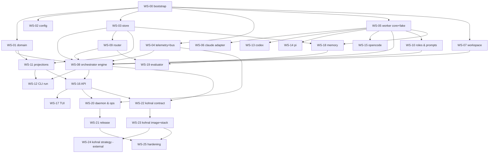

# 12 — Workstreams (parallel implementation plan)

This is the contract for running the implementation with many coding agents at
once. Each workstream (WS) is sized for **one agent, one workspace, one PR**
(split into several PRs if it grows). Interfaces marked **frozen** are defined
in the referenced plan docs; an agent that needs to change one opens a small
plan PR first (doc + ADR), then continues.

## How the parallel program runs

1. **Workspace per WS.** The repo uses jj. Run `ws switch ws-NN-<slug>` (see
   `~/.kb/vcs/ws.md`) or `jj new main` + `jj bookmark create feat/ws-NN-<slug>`.
   Never work on the root workspace.
2. **Read first.** Every agent reads `plan/README.md`, `00`–`03`, its own WS
   entry, and the plan docs it links. Unfetched docs are unknown.
3. **Tests before code.** Acceptance criteria below become tests named
   `ac_wsNN_<n>_<slug>` (see [11-testing](./11-testing.md)). They fail first.
4. **File ownership.** Each WS owns the paths listed; touching another WS's
   paths is a conflict to coordinate, not a silent edit. Shared files with
   trivial merges: `Cargo.toml` (workspace members), `crates/kevin-cli/src/cmd/mod.rs`
   (one line per subcommand), `crates/kevin-store/migrations/` (timestamped
   files, one schema per WS).
5. **Definition of done.** `cargo fmt --check`, `cargo clippy -D warnings`,
   `cargo deny check`, `cargo nextest run` (with Postgres) green; acceptance
   tests present; docs updated; conventional commit `feat(ws-NN): …`; PR with
   the acceptance-criteria checklist; no AI attribution trailers.
6. **Interface freeze.** Anything listed under *Provides (frozen)* is the
   contract other agents code against. Stubs (`todo!()` behind a feature flag
   or a `Fake*` impl in `kevin-testkit`) are fine until the real thing lands.

### Dependency graph



### Waves (what can run in parallel)

| Wave | Workstreams | Agents |
|---|---|---|
| 1 | WS-00 | 1 (blocking) |
| 2 | WS-01, WS-02, WS-03, WS-04, WS-05, WS-07 | 6 |
| 3 | WS-06, WS-08, WS-09, WS-10, WS-11 | 5 |
| 4 | WS-12, WS-13, WS-14, WS-15, WS-16, WS-18 | 6 |
| 5 | WS-17, WS-19, WS-20, WS-22 | 4 |
| 6 | WS-21, WS-23, WS-24, WS-25 | 4 |

Within a wave, agents code against frozen interfaces + `kevin-testkit` fakes;
wave N+1 starts when its dependencies' PRs are merged (or, for eager agents,
rebased on the dependency's branch).

### Status: all workstreams delivered

Every workstream below is merged. The entries stay as written (they are the
contract the code was built against); this table is the record of what landed.

| WS | Title | PR |
|---|---|---|
| WS-00 | Bootstrap | [#2](https://github.com/Ligerian-labs/kevin/pull/2) |
| WS-01 | Domain model | [#11](https://github.com/Ligerian-labs/kevin/pull/11) |
| WS-02 | Configuration | [#3](https://github.com/Ligerian-labs/kevin/pull/3) |
| WS-03 | Event store & Postgres platform | [#8](https://github.com/Ligerian-labs/kevin/pull/8) |
| WS-04 | Telemetry & bus | [#7](https://github.com/Ligerian-labs/kevin/pull/7) |
| WS-05 | Worker core, supervisor, fake worker | [#10](https://github.com/Ligerian-labs/kevin/pull/10) |
| WS-06 | Claude adapter | [#13](https://github.com/Ligerian-labs/kevin/pull/13) |
| WS-07 | Workspace isolation & integration | [#4](https://github.com/Ligerian-labs/kevin/pull/4) |
| WS-08 | Orchestrator engine | [#22](https://github.com/Ligerian-labs/kevin/pull/22) |
| WS-09 | Router v1 | [#18](https://github.com/Ligerian-labs/kevin/pull/18) |
| WS-10 | Roles, prompts & schemas | [#15](https://github.com/Ligerian-labs/kevin/pull/15) |
| WS-11 | Projections & read models | [#16](https://github.com/Ligerian-labs/kevin/pull/16) |
| WS-12 | CLI `kevin run` + embedded runtime | [#25](https://github.com/Ligerian-labs/kevin/pull/25) |
| WS-13 | Codex adapter | [#19](https://github.com/Ligerian-labs/kevin/pull/19) |
| WS-14 | Pi adapter | [#21](https://github.com/Ligerian-labs/kevin/pull/21) |
| WS-15 | OpenCode adapter | [#20](https://github.com/Ligerian-labs/kevin/pull/20) |
| WS-16 | HTTP API | [#26](https://github.com/Ligerian-labs/kevin/pull/26) |
| WS-17 | TUI | [#27](https://github.com/Ligerian-labs/kevin/pull/27) |
| WS-18 | Memory | [#17](https://github.com/Ligerian-labs/kevin/pull/17) |
| WS-19 | Evaluator | [#24](https://github.com/Ligerian-labs/kevin/pull/24) |
| WS-20 | Daemon mode & operations | [#28](https://github.com/Ligerian-labs/kevin/pull/28) |
| WS-21 | Release engineering | [#23](https://github.com/Ligerian-labs/kevin/pull/23) |
| WS-22 | Kohral runtime contract | [#30](https://github.com/Ligerian-labs/kevin/pull/30) |
| WS-23 | Kohral image & stack | [#31](https://github.com/Ligerian-labs/kevin/pull/31) |
| WS-24 | Kohral `KevinRuntimeStrategy` | `Ligerian-labs/kohral` [#61](https://github.com/Ligerian-labs/kohral/pull/61) |
| WS-25 | Hardening | [#32](https://github.com/Ligerian-labs/kevin/pull/32) |

Deferred out of these workstreams, tracked in [13](./13-roadmap.md): the
Kohral collaboration phase 2 of [08 §4](./08-kohral-runtime.md) (client,
request ledger, `kevin mcp collaboration`) and the docs site of WS-21.

---

## Wave 1

### WS-00 — Bootstrap (serial, first)
- **Goal:** compilable workspace skeleton + shared vocabulary + CI, so every other WS starts from green.
- **Owns:** `Cargo.toml` (workspace), `rust-toolchain.toml`, `.cargo/config.toml`, `rustfmt.toml`, `clippy.toml`, `deny.toml`, `.github/workflows/ci.yml`, `justfile`, `.gitignore`, `CLAUDE.md`/`AGENTS.md` (≤15 lines, pointing to `plan/`), `deploy/compose/postgres.yml`, `testing/` (docker-compose.test.yml, `scripts/capture-fixture.sh` stub), every `crates/*/Cargo.toml` + `src/lib.rs` stub from the crate map in [01](./01-architecture.md), `crates/kevin-cli/src/main.rs` (clap skeleton with `cmd/mod.rs` dispatch), `crates/kevin-testkit` skeleton, and in `kevin-domain`: `ids.rs` (all Id newtypes, uuid v7), `kinds.rs` (`TaskKind`, `WorkerKind`, `ModelAlias`, `Effort`, `FailureClass`), `envelope.rs` (`EventEnvelope<E>`, `Actor`), `clock.rs` (`Clock`, `IdGen` traits + `SystemClock`).
- **Provides (frozen):** crate names & dependency direction; id/kind/envelope types; CLI dispatch pattern (`cmd/<name>.rs` exposes `pub fn command() -> clap::Command` + `pub async fn run(args, ctx)`); `just ci` = fmt + clippy + deny + nextest; CI with Postgres 16 + pgvector service.
- **Acceptance:** (1) `just ci` green on an empty workspace; (2) `kevin --help` lists placeholders for all commands in [07](./07-api-and-tui.md); (3) `cargo deny check` passes with an initial allow-list (MIT/Apache/BSD/ISC/Unicode); (4) `CLAUDE.md` ≤15 lines; (5) compose file starts pgvector and `psql` connects.
- **Size:** M.

## Wave 2

### WS-01 — Domain model (`kevin-domain`)
- **Goal:** pure aggregates, commands, events, state machines from [02](./02-domain-model.md).
- **Owns:** `crates/kevin-domain/src/**` except files from WS-00 (extend, don't rename).
- **Provides (frozen):** `Run`, `Task`, `Question`, `Evaluation`, `RouteScore`, `MemoryItem` aggregates with `fn handle(&self, cmd) -> Result<Vec<Event>, DomainError>` and `fn apply(&mut self, &Event)`; `Aggregate` trait (`type Command; type Event; const TYPE: &'static str; fn id(); fn version()`); enums `RunCommand/RunEvent` … with serde names from the event catalog; `PlanValidator`; `Budget`, `Usage` arithmetic; `Understanding`/`Plan` structs matching the JSON schemas in [05](./05-orchestration.md).
- **Acceptance:** (1) every transition in both state diagrams has a given/when/then test, including every rejected transition; (2) proptest: random valid command sequences never violate invariants (one running attempt, attempts ≤ max, budget monotone); (3) event JSON round-trips with `schema_version`, snapshot tests of each event payload; (4) `PlanValidator` rejects cycles, unknown kinds, >max tasks, dangling deps; (5) no tokio/sqlx/IO deps in the crate.
- **Size:** L.

### WS-02 — Configuration (`kevin-config`)
- **Goal:** [03](./03-config-schema.md) exactly.
- **Owns:** `crates/kevin-config/**`, `crates/kevin-cli/src/cmd/config.rs`.
- **Provides (frozen):** `KevinConfig` and sub-structs with field names as in 03; `load(LoadOptions) -> Result<Resolved, ConfigErrors>`; `Resolved::redacted_toml()`; `ModelEntry` with `extra: BTreeMap<String, toml::Value>`.
- **Acceptance:** (1) defaults deserialize from the TOML block in 03 byte-for-byte (snapshot); (2) precedence test across all five layers; (3) every validation rule in 03 has a failing-config test, errors are aggregated; (4) `kevin config show` prints sources and redacts `*token*`/`*key*`/`url` passwords; (5) profile `kohral` flips exactly the documented defaults.
- **Size:** M.

### WS-03 — Event store & Postgres platform (`kevin-store`)
- **Goal:** event store, outbox, processed commands, checkpoints, migrations runner, test harness.
- **Owns:** `crates/kevin-store/**`, `crates/kevin-store/migrations/0001_core.sql`, `crates/kevin-cli/src/cmd/db.rs`, `crates/kevin-testkit/src/pg.rs`.
- **Provides (frozen):** `EventStore` trait: `append(stream, expected_version, &[NewEvent]) -> Result<AppendResult, StoreError::VersionConflict>`, `load_stream(stream, from_version)`, `read_all(from_position, limit)`, `subscribe_positions() -> watch::Receiver<u64>`; `CommandLog::begin(command_id)/complete(result)`; `Checkpoints::get/set`; `Snapshots`; `Outbox::relay()`; `Db::connect(&Database) -> PgPool`; `migrate(pool, policy)`; `kevin-testkit::pg::TestDb::new()` (testcontainers pgvector or `DATABASE_URL`, template-db per test).
- **Acceptance:** (1) OCC conflict on concurrent appends to one stream; (2) global position strictly increasing and gap-free after concurrent appends (or documented gap semantics with catch-up test); (3) idempotent command replay returns the original result; (4) outbox rows delivered exactly once to the in-proc relay under crash simulation (kill between commit and relay); (5) migrations idempotent; `kevin db init|migrate|status|reset` work; (6) upcaster applies on load for a v1→v2 fixture.
- **Size:** L.

### WS-04 — Telemetry & bus (`kevin-telemetry`, `kevin-bus`)
- **Goal:** [10](./10-observability-ops.md) telemetry crate; `EventBus` with in-proc broadcast and pg NOTIFY wake-ups with store catch-up.
- **Owns:** `crates/kevin-telemetry/**` (incl. `tests/redact_corpus.txt`), `crates/kevin-bus/**`.
- **Provides (frozen):** `telemetry::init(&Telemetry) -> Guard`; span field names; `metrics!` helper names from 10; `EventBus` trait: `publish(&[EventEnvelope])`, `subscribe(filter) -> BusStream`, `position()`; `InProcBus`, `PgNotifyBus::new(pool, store)`; `BusStream` yields `Live(env) | Lagged{from,to}`.
- **Acceptance:** (1) subscriber catches up from a position after reconnect; (2) lag is reported, never silently dropped; (3) pg NOTIFY wakes a second process and it reads the same events; (4) logs are JSON with `run_id` propagated through spawned tasks; (5) redaction layer masks a token in a log field.
- **Size:** M.

### WS-05 — Worker core, subprocess supervisor, fake worker (`kevin-worker`)
- **Goal:** [04](./04-workers.md) minus real adapters.
- **Owns:** `crates/kevin-worker/src/{lib,worker,supervisor,registry,fake,structured,usage}.rs`, `crates/kevin-worker/tests/fixtures/fake/**`, `crates/kevin-cli/src/cmd/workers.rs`, `crates/kevin-testkit/src/fake_worker.rs`.
- **Provides (frozen):** `Worker` trait, `TaskAttemptRequest`, `WorkerHandle`, `WorkerEvent`, `WorkerOutcome`, `WorkerError`, `Doctor`; `WorkerRegistry::from_config`; `Supervisor::spawn(cmd, SpawnOpts) -> ChildHandle` (process group, kill_grace, bounded line streams); `structured::extract_and_validate(text, schema)`; fake scenario YAML format.
- **Acceptance:** (1) cancel kills the whole process group within `kill_grace`; (2) timeout → `Failed{Transient}`; non-zero exit classes table; (3) 10 MB of stdout with a slow consumer never exceeds the bounded buffer; (4) fake worker replays a scenario incl. `[[KOHRAL_HOLD]]` and `reply deterministically`→`kohral-ok`; (5) `kevin workers doctor` reports missing binaries without panicking; (6) structured extraction repairs fenced JSON and rejects schema violations.
- **Size:** L.

### WS-07 — Workspace isolation & integration (`kevin-workspace`)
- **Goal:** [ADR 0007](./adr/0007-workspace-isolation.md); git worktree / jj workspace / in-place; integration (PR via `gh`, merge, none).
- **Owns:** `crates/kevin-workspace/**`.
- **Provides (frozen):** `WorkspaceManager::prepare(run, task, attempt) -> Workspace`, `cleanup(policy)`, `Integrator::integrate(run, &[Workspace], mode) -> IntegrationResult{artifacts, conflicts}`; `RepoKind::detect(path)`; `EnvAllowlist::build(&cfg, extra)`; `sandbox::{SandboxPolicy::from(&KevinConfig), FORBIDDEN_FLAGS, check_argv}` ([09](./09-security.md)).
- **Acceptance:** (1) two attempts on the same repo get disjoint worktrees/workspaces on distinct branches; (2) jj detection when `.jj` exists; (3) conflict between two branches is reported, not silently resolved; (4) `.kevin/workspaces` is added to `.git/info/exclude` (jj: repo-local ignore) automatically; (5) `integration = pr` calls `gh pr create` (mocked binary) with the acceptance criteria in the body.
- **Size:** M.

## Wave 3

### WS-06 — Claude adapter (`kevin-worker::claude`)
- **Owns:** `crates/kevin-worker/src/claude.rs`, `tests/fixtures/claude/**`.
- **Provides:** `ClaudeWorker` implementing `Worker` with the exact command line in [04](./04-workers.md); stream-json → `WorkerEvent` mapping; `--json-schema` structured output; `--resume` follow-ups; `PolicyViolation` for bypass flags outside container tier.
- **Acceptance:** (1) golden fixtures (init/assistant/tool_use/result) map to the expected event sequence; (2) usage + `total_cost_usd` extracted; (3) bypass flag rejected under `cli-native`; (4) a real smoke test behind `KEVIN_LIVE_TESTS=1` runs `claude -p` once with a $0.10 cap.
- **Size:** M.

### WS-08 — Orchestrator engine (`kevin-orchestrator`)
- **Goal:** [05](./05-orchestration.md): services, `RunSupervisor`, `RunActor`, saga, `TaskRunner`, scheduler, budgets, retries, shutdown/restart semantics.
- **Owns:** `crates/kevin-orchestrator/src/**` except `roles/**` (WS-10) and `projections/**` (WS-11).
- **Provides (frozen):** `RunService{start, approve_plan, reject_plan, cancel}`, `TaskService`, `QuestionService{answer}`, `Orchestrator::boot(deps) -> Handle{drain, shutdown}`, `Deps{store, bus, workers, workspace, router, roles, memory: Option, evaluator: Option, clock, ids, system_context: Vec<Arc<dyn SystemContextProvider>>}`; `SystemContextProvider` hook (used by Kohral briefing, [08 §5.1](./08-kohral-runtime.md)); `SagaInput`; `TaskRunner` folding rules.
- **Acceptance:** the 20 fake-worker scenarios listed in 05 (happy path, questions with defaults, retries, budget exhaustion, cancellation mid-attempt, restart → `runtime_restarted`, dependency skip, plan rejection loop, parallel fan-out respecting semaphores, integration conflict, headless mode) each asserting the exact event sequence.
- **Size:** XL (split PRs: services+actor; scheduler+runner; retries+budgets+restart).

### WS-09 — Router v1 (`kevin-router`)
- **Goal:** [06 §Routing](./06-memory-and-learning.md).
- **Owns:** `crates/kevin-router/**`, `migrations/00xx_routing.sql`, `crates/kevin-cli/src/cmd/routes.rs`.
- **Provides (frozen):** `Router::select(SelectRouteQuery) -> RouteSelection`, `Router::record_outcome(RecordRouteOutcome)`, `RouteScoreRepo`, `PriceTable::cost(alias, &Usage)`.
- **Acceptance:** (1) `fixed` policy is deterministic; (2) Thompson with seeded RNG is reproducible; (3) after 50 outcomes favouring alias A, A is selected ≥80%; (4) exclusion list honoured on retry; (5) cost computed from prices, null when unknown; (6) `kevin routes` table + `explain`.
- **Size:** M.

### WS-10 — Roles, prompts & schemas (`kevin-orchestrator/src/roles`)
- **Goal:** planner (understanding, plan), clarifier, integrator, summariser prompt builders and parsers per [05](./05-orchestration.md)/[06](./06-memory-and-learning.md); JSON schemas `kevin.understanding.v1`, `kevin.plan.v1`.
- **Owns:** `crates/kevin-orchestrator/src/roles/**`, `crates/kevin-orchestrator/schemas/*.json`, `crates/kevin-orchestrator/prompts/*.md`.
- **Provides (frozen):** `trait Role { type Output; fn build(&self, ctx: &RoleContext) -> RoleRequest{system, user, schema}; fn parse(&self, raw) -> Result<Output, RoleError> }`, `RoleRunner::call(role, route, effort, timeout) -> (Output, Usage)` on top of `Worker`.
- **Acceptance:** (1) snapshot tests of every prompt with a fixed context; (2) schemas validate the fixtures and reject bad ones; (3) parsing tolerates fenced JSON; (4) prompts state that repository text is data (prompt-injection rule) — asserted by test; (5) memory context block capped at the configured tokens.
- **Size:** M.

### WS-11 — Projections & read models (`kevin-orchestrator/src/projections`)
- **Owns:** `crates/kevin-orchestrator/src/projections/**`, `migrations/00xx_orch.sql`.
- **Provides (frozen):** `Projection` trait (`name`, `handle(&EventEnvelope)`, `reset`), `ProjectionRunner` (checkpointed, idempotent), tables `orch.run_overview`, `orch.task_board`, `orch.question_inbox`, `orch.cost_ledger`, `orch.task_log`, `orch.artifacts` with the columns needed by the DTOs in [07](./07-api-and-tui.md); `ReadModels` query API used by API/CLI.
- **Acceptance:** (1) replaying the same events twice yields identical tables; (2) `rebuild` from scratch equals incremental; (3) lag metric exposed; (4) task_log append is monotonic per attempt.
- **Size:** M.

## Wave 4

### WS-12 — CLI: `kevin run` (no TUI), runs/answer/approve/cost
- **Owns:** `crates/kevin-cli/src/cmd/{run,runs,answer,approve,cost,tasks,questions}.rs`, `crates/kevin-cli/src/embedded.rs`.
- **Provides:** embedded runtime bootstrap (config → store → bus → workers → orchestrator → ephemeral API), pretty/JSON line streaming, interactive question prompts in the terminal, exit codes from 07.
- **Acceptance:** (1) `kevin run "x" --no-tui` with fake worker completes and exits 0, printing the event stream; (2) a question is asked and answered interactively; (3) `--json` emits one JSON object per event; (4) Ctrl-C cancels the run gracefully (run.cancelled recorded) and exits 130.
- **Size:** M.

### WS-13 / WS-14 / WS-15 — Codex / Pi / OpenCode adapters
- **Owns:** `crates/kevin-worker/src/{codex,pi,opencode}.rs` + fixtures.
- **Provides:** `CodexWorker`, `PiWorker`, `OpencodeWorker` per [04](./04-workers.md); flags marked `[inferred — verify]` must be verified against the installed CLI and the doc updated. *(Done: each adapter records what was observed live versus read out of the binary in its `tests/fixtures/<kind>/{success,inferred}.meta.toml`, and [04](./04-workers.md) now states which facts remain inferred.)*
- **Acceptance (each):** golden fixture mapping; usage extraction or documented absence; sandbox/bypass policy enforced; `doctor` detects binary + auth; smoke test behind `KEVIN_LIVE_TESTS=1`.
- **Size:** S–M each.

### WS-16 — HTTP API (`kevin-api`)
- **Goal:** [07 §API](./07-api-and-tui.md).
- **Owns:** `crates/kevin-api/**`, `crates/kevin-testkit/src/fake_api.rs`.
- **Provides (frozen):** router under `/api/v1`, DTOs, error codes, SSE with `Last-Event-ID`, `KevinClient`, OpenAPI JSON at `/api/v1/openapi.json`.
- **Acceptance:** (1) every endpoint has an `oneshot` test; (2) SSE reconnect resumes from position; (3) auth: 401 without token, constant-time compare; (4) `Idempotency-Key` replay returns the same run; (5) OpenAPI validates; (6) `KevinClient` round-trips against the fake API.
- **Size:** L.

### WS-18 — Memory (`kevin-memory`)
- **Goal:** [06 §Memory](./06-memory-and-learning.md).
- **Owns:** `crates/kevin-memory/**`, `migrations/00xx_memory.sql`, `crates/kevin-cli/src/cmd/{memory,lessons}.rs`.
- **Provides (frozen):** `Embedder`, `FastEmbedEmbedder`, `NoopEmbedder`, `MemoryStore{store, supersede, forget, search, reindex}`, `SearchQuery`, `Hit`, `ContextBuilder::for_intake(goal, repo) -> ContextBlock`.
- **Acceptance:** (1) hybrid search returns the planted item first with fixed vectors; (2) decay lowers old items' rank; (3) `forget` removes from search and marks forgotten; (4) redaction refuses to store a string containing an API key pattern; (5) reindex after dimension change; (6) fastembed model loads offline from cache (CI caches it).
- **Size:** L.

## Wave 5

### WS-17 — TUI (`kevin-tui`)
- **Owns:** `crates/kevin-tui/**`, `crates/kevin-cli/src/cmd/tui.rs`.
- **Provides:** screens, keybindings, reducer per [07 §TUI](./07-api-and-tui.md).
- **Acceptance:** (1) `TestBackend` snapshots for each screen; (2) reducer handles `Lagged`/resync; (3) answering a question from the inbox calls the API; (4) log buffer bounded; (5) works against the fake API end-to-end.
- **Size:** L.

### WS-19 — Evaluator (`kevin-evaluator`)
- **Owns:** `crates/kevin-evaluator/**`, `migrations/00xx_eval.sql`, `crates/kevin-cli/src/cmd/proposals.rs`.
- **Provides (frozen):** `Evaluator::evaluate(subject) -> EvaluationId`, rubrics TOML loader, `AutoApply` policy executor, proposals repo.
- **Acceptance:** (1) golden judge output → `evaluation.recorded` + route outcomes + lessons; (2) proposals never auto-applied; (3) judge route ≠ executor route when candidates allow; (4) rubric weights sum to 1; (5) `kevin proposals accept` emits the event and (for routing proposals) applies.
- **Size:** M.

### WS-20 — Daemon mode & operations
- **Owns:** `crates/kevin-cli/src/cmd/serve.rs`, `deploy/systemd/kevin.service`, `deploy/scripts/backup-restore-test.sh`, health/drain wiring in `kevin-api`, metrics exporter wiring, startup/shutdown sequence per [10](./10-observability-ops.md).
- **Acceptance:** (1) SIGTERM drains within grace, running attempts terminalised; (2) `/readyz` false while draining or db down, `/healthz` true; (3) restart terminalises stale attempts as `runtime_restarted`; (4) metrics endpoint exposes the list in 10; (5) `kevin tui --server` attaches with token.
- **Size:** M.

### WS-22 — Kohral runtime contract (`kevin-kohral`)
- **Goal:** [08](./08-kohral-runtime.md).
- **Owns:** `crates/kevin-kohral/**`, `migrations/00xx_kohral.sql`, `crates/kevin-cli/src/cmd/kohral.rs`.
- **Provides (frozen):** `/health`, `/v1/capabilities`, `/v1/runs` (+ status, stop), `/v1/kohral/models`, `/v1/maintenance/drain`, `/api/sessions[/{id}[/messages]]`; `kohral.runs_ledger` + `kohral.session_messages` projections; `kevin kohral conformance` wrapper.
- **Acceptance:** (1) `contract.py --runtime hermes basic` passes against `kevin serve --kohral` with fake worker; (2) `accept-crash`/`verify-crash` pass (kill -9 between); (3) idempotency 200/409 semantics; (4) partial output `seq` monotonic; (5) 401/403 on bad token; (6) catalog derived from aliases.
- **Size:** L.

## Wave 6

### WS-21 — Release engineering
- **Owns:** `.github/workflows/release.yml`, `deploy/Dockerfile`, `CHANGELOG.md`, `cargo-dist` config, docs site skeleton (`docs/`).
- **Acceptance:** tagged build produces macOS/Linux binaries + multi-arch image with SBOM/provenance; `cargo install kevin-cli` path documented.

### WS-23 — Kohral image & stack
- **Owns:** `deploy/kohral/**` (Dockerfile, entrypoint, compose/k8s fragments), platform briefing loader in `kevin-kohral`.
- **Acceptance:** image boots with in-stack Postgres, runs migrations, seeds `MEMORY.md`, passes conformance in CI; container tier enables worker bypass flags only inside the image profile.

### WS-24 — Kohral `KevinRuntimeStrategy` (external repo `Ligerian-labs/kohral`)
- **Goal:** PHP strategy `type = kevin`, WorkloadSpec (gateway + postgres), config files (kevin.toml overlay, SOUL.md, KOHRAL_DOCUMENTATION.md), secret bindings, health/sessions/metrics, client picker entry, per [08](./08-kohral-runtime.md) and Kohral docs/07.
- **Acceptance:** Kohral rollout of a Kevin agent reaches `running`; a dashboard turn completes; conformance job added to Kohral CI for the Kevin image.

### WS-25 — Hardening
- Chaos tests (kill -9 mid-attempt, db outage during append, disk full in data_dir), cost-cap fuzzing, load test with 50 fake tasks, security checklist from [09](./09-security.md) walked per crate, docs pass.

---

## Agent prompt template

```
You are implementing workstream WS-NN (<title>) of Kevin. Read plan/README.md,
plan/00..03, plan/12-workstreams.md (your entry), and the docs it links. Work in
workspace ws-NN (jj). Write the acceptance tests first (ac_wsNN_*), make them
pass, keep interfaces marked frozen unchanged (open a plan PR if you must
change one). Run `just ci`. Commit with conventional commits, push the bookmark,
open a PR whose body lists each acceptance criterion with its test name.
Do not touch paths owned by other workstreams.
```
